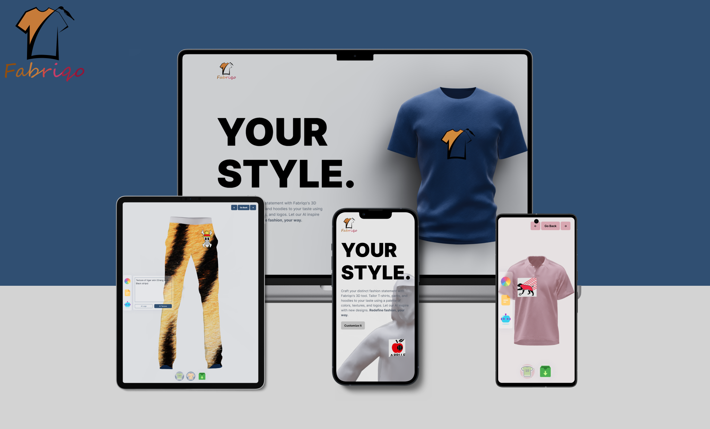

<div align="center">
  
</div>

# Fabriqo

Discover the limitless possibilities of self-expression with Fabriqo's cutting-edge web application. Elevate your wardrobe to new heights by personalizing T-shirts, pants, and hoodies with a kaleidoscope of colors, textures, and logos. Our integrated AI opens doors to a world of creativity, generating fresh logos and textures that match your individuality. Embrace the power of customization and transform clothing into wearable art, all at your fingertips. Your style, your rules – embark on a journey of sartorial innovation with Fabriqo.

## Demo

Fabriqo is deployed to Vercel. You can try it on the following URL: [fabriqo.vercel.app](https://fabriqo.vercel.app/).

<div align="center">
  
</div>

## Technologies Used

- Client Side
  - React.js
  - Tailwind
  - Three.js
  - React Three Fiber
  - Framer Motion
- Server Side
  - Node.js
  - Express.js
  - OpenAI API

## Installation

To install and run Fabriqo locally, follow these steps:

1. Clone the project repository.
2. Navigate to server directory.

```
cd server
```

3. Install the necessary dependencies by running the following command:

```
npm install
```

4. Replace the environment variables with your own API keys.
5. Run the server on localhost by running the following command

```
npm start
```

6. Go back to client directiory.

```
cd ../client
```

7. Install the necessary dependencies by running the following command:

```
npm install
```

8. Run the project by executing the following command:

```
npm run dev
```

9. Access the application by visintg http://localhost:5173/
